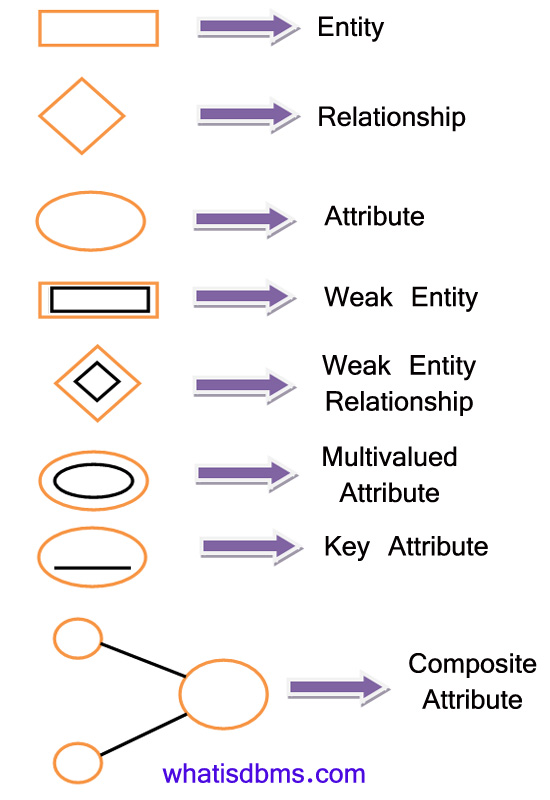

### **Entity-Relationship (ER) Model: An In-Depth Explanation**

The **Entity-Relationship (ER) Model** is a high-level conceptual data model used to represent the logical structure of a database in a clear and understandable manner. It is based on the concept of **entities**, **attributes**, and **relationships**, providing a way to visually map how data relates to one another in a system. The ER Model is often used in the design phase of a database to ensure a proper understanding of the data requirements.

---

### **Key Components of the ER Model**

1. **Entities**:
   - Entities represent **objects** or **things** in the real world that have distinct existence.
   - Entities can be **physical objects** (e.g., a person, car) or **conceptual objects** (e.g., a course, project).

   **Types of Entities**:
   - **Strong Entity**: 
     - Exists independently.
     - Has a unique identifier called a **primary key**.
     - Example: `Student`, `Book`.
   - **Weak Entity**: 
     - Cannot exist without being associated with a strong entity.
     - Depends on a **foreign key** from the related strong entity.
     - Example: `Order_Item` is dependent on `Order`.

2. **Attributes**:
   - Attributes define **properties** or **characteristics** of an entity or a relationship.
   - Example: A `Student` entity might have attributes like `Student_ID`, `Name`, and `Age`.

   **Types of Attributes**:
   - **Simple Attributes**: Cannot be divided further (e.g., `Name`, `Age`).
   - **Composite Attributes**: Can be divided into smaller sub-parts (e.g., `Full Name` → `First Name` and `Last Name`).
   - **Derived Attributes**: Can be derived from other attributes (e.g., `Age` can be derived from `Date of Birth`).
   - **Multivalued Attributes**: Can have multiple values (e.g., `Phone Numbers`).

3. **Relationships**:
   - Relationships represent **associations** between two or more entities.
   - Example: A `Student` "enrolls in" a `Course`.

   **Types of Relationships**:
   - **One-to-One (1:1)**: Each entity in set A is related to exactly one entity in set B, and vice versa.  
     Example: A person has **one passport**, and each passport is assigned to one person.
   - **One-to-Many (1:N)**: An entity in set A can be associated with multiple entities in set B, but an entity in set B is associated with only one entity in set A.  
     Example: A department has multiple employees, but each employee belongs to one department.
   - **Many-to-Many (M:N)**: Entities in set A can be associated with multiple entities in set B, and vice versa.  
     Example: Students can enroll in multiple courses, and courses can have multiple students.

4. **Primary Key**:
   - A unique identifier for an entity.
   - Example: `Student_ID` for the `Student` entity.

5. **Entity Sets and Relationship Sets**:
   - **Entity Set**: A collection of entities of the same type (e.g., all `Students`).
   - **Relationship Set**: A collection of relationships of the same type (e.g., all `enrolls in` relationships).

---

### **ER Diagram**

The ER Model is commonly represented using an **ER Diagram**, a graphical representation of entities, attributes, and relationships.

#### **ER Diagram Symbols**:
| **Component**      | **Symbol**            |
|---------------------|-----------------------|
| Entity (Rectangle)  |  Rectangle          |
| Weak Entity         | Double Rectangle   |
| Attribute           | Ellipse            |
| Key Attribute       | Ellipse (underlined)|
| Relationship        | Diamond            |
| Multivalued Attribute| Double Ellipse     |
| Derived Attribute   | Dashed Ellipse      |
| Weak Relationship   | Double Diamond     |



#### **Example: University Database**

Imagine a system where students enroll in courses:

1. Entities:
   - `Student` (attributes: `Student_ID`, `Name`, `Age`)
   - `Course` (attributes: `Course_ID`, `Title`, `Credits`)

2. Relationship:
   - `Enrolls` (attributes: `Enrollment_Date`)

**ER Diagram**:
```
Student
  ├── Student_ID (PK)
  ├── Name
  ├── Age
    |
    | Enrolls
    |
Course
  ├── Course_ID (PK)
  ├── Title
  ├── Credits
```

---

### **Advantages of the ER Model**

1. **Conceptual Clarity**:
   - The ER Model provides a high-level, easy-to-understand representation of data.

2. **Simplifies Design**:
   - Helps in database design by visualizing entities, attributes, and their relationships.

3. **Facilitates Communication**:
   - Acts as a blueprint for database developers and stakeholders to communicate clearly about data requirements.

4. **Flexibility**:
   - Adaptable to represent both simple and complex relationships.

5. **Foundation for Implementation**:
   - Can be directly converted into a relational schema for implementation.

---

### **Disadvantages of the ER Model**

1. **Complexity for Large Systems**:
   - For large databases with many entities and relationships, the diagram can become cluttered and hard to interpret.

2. **No Implementation Details**:
   - The ER Model is conceptual and does not address physical storage, performance optimization, or implementation details.

3. **Limited Representation**:
   - Does not natively support advanced data types like multimedia or unstructured data.

---

### **Use Cases of ER Model**

1. **University Systems**:
   - Mapping students, courses, professors, and enrollments.

2. **Hospital Management**:
   - Representing patients, doctors, appointments, and treatments.

3. **E-Commerce Platforms**:
   - Modeling customers, orders, products, and payments.

4. **Banking Systems**:
   - Representing customers, accounts, transactions, and loans.

---

### **Conclusion**

The **ER Model** is a powerful tool for designing databases, offering a clear and intuitive way to represent data and relationships. It is particularly useful in the conceptual design phase, ensuring that all stakeholders have a shared understanding of the system’s data requirements. While it has some limitations, its strengths make it a foundational concept in database management systems (DBMS).